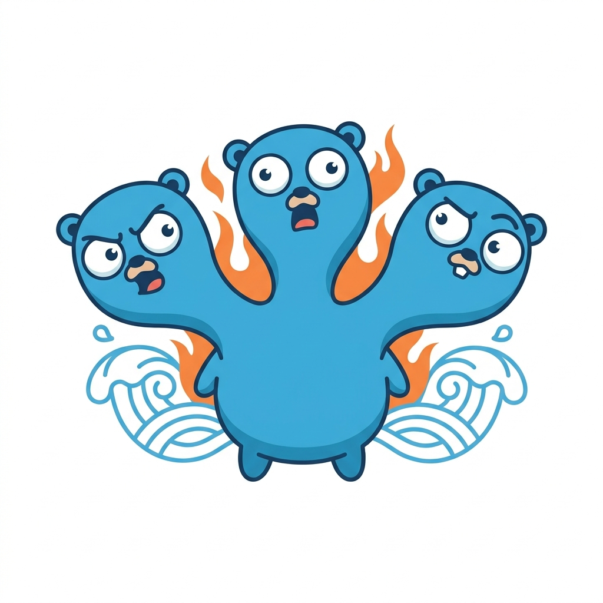

# 👺 maikubi - API Regression Diff Client

<div align="center">
  
  
  <h3>Supercharged API Regression Testing & Diff Desktop Client (Wails + React)</h3>
  <p>Inspired by the principles of Diffy, maikubi safe-guards your API development by replay-comparing staging, production, and baseline environments with real-time automatic noise filtering.</p>

  <!-- Language Selector Tabs -->
  <table>
    <tr>
      <td align="center" width="150" style="background-color: #1e1e24; border: 1px solid #333;">
        <a href="#-english" style="text-decoration: none; font-weight: bold; color: #64b5f6;">🇺🇸 English</a>
      </td>
      <td align="center" width="150" style="background-color: #1e1e24; border: 1px solid #333;">
        <a href="#-日本語" style="text-decoration: none; font-weight: bold; color: #81c784;">🇯🇵 日本語</a>
      </td>
    </tr>
  </table>
</div>

---

<a name="-english"></a>
## 🇺🇸 English

### 1. Project Overview

**maikubi** (named after the legendary Japanese dancing head) is a desktop API regression testing client built with Wails (Go) and React + TypeScript. Unlike proxy-based regression tools, it uses a **"replay-style (HTTP Client)"** approach, allowing you to safely regression-test APIs without dirtying OS proxy configurations.

*   **3-Way Environment Replay**: Concurrently replicates and sends a single request to **Production**, **Staging**, and **Baseline** environments.
*   **Automatic Noise Cancellation**: Replays request on both Production and Baseline (which run the same old code). Any differing fields (e.g. timestamps, random UUIDs, dynamic IDs) are marked as "noise paths" and automatically filtered out when comparing Staging.
*   **Interactive Split / Unified Diff View**: Features a real-time layout toggle.
    *   **📊 Split View**: Side-by-side comparison synchronizing the scrolling of Baseline and Staging perfectly using virtual elements (no scrolling lag or misalignment). Highlights value modifications (Modified) in yellow on the same row.
    *   **📝 Unified View**: Displays unified modifications linearly with GitHub-style `+` and `-` prefix lines.
*   **Real-time Interactive Ignore (JSONPath)**: Hover over any diff line and click `🚫 Ignore` to immediately exclude that specific JSONPath (with array wildcard `[*]` support). The view recalculates instantly in memory without refetching the API!
*   **Ultra-Performance Virtual Scrolling**: Equipped with `@tanstack/react-virtual`, the client renders 10,000+ lines of JSON diffs with ease at 60 FPS.
*   **Supercharged HTTP Connection Pooling**: Employs a custom `http.Transport` (`MaxIdleConns: 100`, `MaxIdleConnsPerHost: 10`, `IdleConnTimeout: 90s`) to reuse TCP/TLS keep-alive connections, eliminating TLS handshake overhead and guaranteeing hyper-fast parallel request dispatch.
*   **Context-Aware Request Propagation**: Seamlessly propagates Go's `context.Context` down to the HTTP transport layer. If you cancel a request or close the app, all ongoing HTTP socket connections are immediately torn down safely.
*   **Unified Developer Console Logging**: Integrates Wails `runtime` logging, which dynamically pipes Go-backend runtime status (request dispatch, JSON normalization, error traces) directly into the frontend WebView Developer Console for unparalleled debug trace visibility.

---

### 2. Getting Started (Prerequisites & Commands)

#### Prerequisites
*   **Go** (1.20+)
*   **Node.js** (16+) & **npm**
*   **Wails CLI** (Install via `go install github.com/wailsapp/wails/v2/cmd/wails@latest`)
*   **Docker & Docker Compose** (Only for running local testing servers)

#### Makefile Commands
We provide a unified `Makefile` for ease of execution.

| Command | Description |
|---|---|
| `make dev` | Launches the Wails desktop application in hot-reload development mode. |
| `make build` | Compiles the production bundle into a standalone native application (`build/bin/`). |
| `make test` | Runs the Go backend tests (testing JSON diff matching & noise cancellation engines). |
| `make tidy` | Tidies up Go module dependencies (`go mod tidy`). |
| `make clean` | Cleans up built binary assets and frontend build cache. |
| `make docker-up` | Builds and starts 3 local mock API servers (Production, Staging, Baseline). |
| `make docker-down` | Stops and removes the local mock API containers. |
| `make docker-logs` | Streams logs from the mock API containers. |

---

### 3. Testing & Verification Guide

To quickly verify the capabilities of maikubi (including its automatic noise canceler), you can spin up our local pre-configured Go mock servers.

#### Step 1: Start the Mock Servers
Make sure your Docker Desktop is running, then execute:
```bash
make docker-up
```
This launches 3 identical Go web services mapped to different ports with different environment variables:
*   **Production**: `http://localhost:8081` (Old stable version)
*   **Staging**: `http://localhost:8082` (New version with intentional regressions)
*   **Baseline**: `http://localhost:8083` (Old stable version for differential verification)

#### Step 2: Configure maikubi UI
Open the maikubi desktop app (run `make dev` if in dev mode) and enter the settings:

1.  **Environment Base URLs**:
    *   *Production*: `http://localhost:8081`
    *   *Staging*: `http://localhost:8082`
    *   *Baseline*: `http://localhost:8083`
2.  **Common Request Settings**:
    *   *Method*: `GET` (or `POST`)
    *   *Path*: `/api/v1/users`
    *   *Body* (if using `POST`):
        ```json
        {
          "name": "Bob",
          "role": "User"
        }
        ```
3.  Click **Run Diff**.

#### Step 3: Analyze the Results
*   **Filtered Noise**: Note that `timestamp` (execution time) and `request_id` (random strings) values differ between Production and Baseline. Maikubi **automatically detects this as noise** and displays these lines as **Matched (White)**!
*   **Regressions Detected (GET)**: The differences inside the Staging environment (`name` changing to `"Alice Pro"`, `role` changing to `"Administrator"`, and a new `email` field added) are clearly highlighted in **Green (Added)** and **Red (Deleted)**.
*   **Regressions Detected (POST)**: If you performed a `POST` request, the response values you sent will be echoed back. However, the Staging environment will modify your input name to add `" Pro"` (e.g., `"Bob"` ➔ `"Bob Pro"`), override the role to `"Administrator"`, and add a new `email` field (`"posted.user.pro@example.com"`). Production and Baseline will echo your exact input. The automatic noise filter will still filter out `timestamp` and `request_id` changes perfectly.
*   **Manual Ignore Test**: Hover over `meta.version` line, click the `🚫 Ignore` button. Watch the diff instantly update and show the version mismatch line as matched (white).

---

### 4. Project Directory Structure
```text
maikubi/
  ├── app.go                  # Main Wails bridge controller
  ├── main.go                 # App entrypoint
  ├── Makefile                # Task runner configuration
  ├── docker-compose.yml      # Testing servers orchestration
  ├── README.md               # Application manual (Eng & Jpn)
  ├── backend/
  │     ├── model/            # Go-React shared structures
  │     └── service/          # Diff matching & noise detector engines
  ├── frontend/
  │     ├── src/              # React TSX source files
  │     └── wailsjs/          # Auto-generated TS bindings
  └── test-servers/           # Local dockerized mock Go API servers
```

---

<a name="-日本語"></a>
## 🇯🇵 日本語

### 1. プロジェクト概要

**maikubi（舞首）** は、Wails (Go) と React + TypeScript で構築されたデスクトップ向けの API リグレッション（退行）テストクライアントです。プロキシ設定を汚す一般的なプロキシ型ツールとは異なり、安全にAPIリグレッションテストを行える **「リプレイ型（HTTPクライアント型）」** アーキテクチャを採用しています。

*   **3環境同時リクエスト複製（リプレイ）**: `Production (本番)`、`Staging (検証)`、`Baseline (テスト)` の3環境へ同時に同一リクエストを複製して送信します。
*   **自動ノイズカット機能**: 同一の旧コードが動く `Production` と `Baseline` を比較し、実行のたびに値が変わる「動的ノイズフィールド（タイムスタンプや一時IDなど）」を自動検出。Staging比較時にこれらを**自動的に一致（Matched）扱いとして除外**します。
*   **対話型 Split / Unified 差分ビュー**: リアルタイムに切り替え可能なレイアウトトグルを搭載。
    *   **📊 Split View (左右並列表示)**: Baseline と Staging を左右対称に並べ、行の高さが完全にシンクロする同期スクロール表示（ズレが一切発生しません）。同一キーの値の変更（Modified）を**黄色**で同じ行に対比表示します。
    *   **📝 Unified View (GitHub風表示)**: 慣れ親しんだ GitHub ライクな `+` と `-` のマークが付いた縦1列の統合表示。
*   **リアルタイム対話型 Ignore (JSONPath)**: UI上の差分行にホバーして `🚫 Ignore` をクリックするだけで、配列ワイルドカード `[*]` に対応した特定の JSONPath を無視リストに登録。APIへの再送信なく、**フロントエンドとメモリ内だけで超高速に差分を再計算・再描画**します。
*   **超高速バーチャルスクロール**: `@tanstack/react-virtual` の導入により、数万行規模の巨大なJSON差分であってもフリーズすることなく、最小限のDOMフットプリントでヌルヌルと軽快に動作します。
*   **チューニングされた接続プール（HTTP/1.1 Keep-Alive）**: カスタム `http.Transport` 設定（最大アイドル接続: 100、ホスト毎最大: 10、アイドルタイムアウト: 90秒）を内蔵。TCP/TLSハンドシェイクのオーバーヘッドを極限まで排除し、複数環境への同時リプレイ実行を大幅に高速化します。
*   **コンテキスト伝播による安全な制御**: WailsのライフサイクルからHTTPクライアントの末端まで Go の `context.Context` を完全に引き回す設計。リクエストキャンセル時やアプリ終了時に、実行中のHTTPソケット接続を安全かつ即座にシャットダウンします。
*   **フロントエンドへのログ統合（Wails Runtime Logging）**: Goバックエンドの動作ログ（リクエスト開始、JSON正規化、エラー原因など）を、フロントエンドのWebView開発者ツールのコンソールへ自動的に転送出力。一元化されたシームレスなデバッグ環境を提供します。

---

### 2. クイックスタート (前提条件とコマンド)

#### 前提条件
*   **Go** (1.20以上)
*   **Node.js** (16以上) & **npm**
*   **Wails CLI** (`go install github.com/wailsapp/wails/v2/cmd/wails@latest` でインストール可能)
*   **Docker & Docker Compose** (ローカル検証用サーバー起動にのみ必要)

#### Makefile コマンド
操作を容易にするために `Makefile` を完備しています。

| コマンド | 説明 |
|---|---|
| `make dev` | Wails アプリをホットリロード有効の開発モードで起動します。 |
| `make build` | スタンドアロンな本番用デスクトップアプリをビルドします（`build/bin/` に出力）。 |
| `make test` | バックエンド（Go）のJSON差分＆ノイズキャンセリングエンジンのテストを実行します。 |
| `make tidy` | Goモジュールの依存関係を整理します (`go mod tidy`)。 |
| `make clean` | ビルドされたバイナリ成果物やフロントエンドのキャッシュを削除します。 |
| `make docker-up` | テスト検証用の3つのローカルモックAPIサーバーをDockerでビルド・起動します。 |
| `make docker-down` | ローカル検証用APIコンテナを停止・削除します。 |
| `make docker-logs` | ローカル検証用APIコンテナのログをリアルタイムで表示します。 |

---

### 3. テスト・検証ガイド

本アプリの主要機能である「自動ノイズカット」や「差分表示」の動きをローカルで手軽に体験するための検証手順です。

#### ステップ 1: 検証用APIサーバーの起動
Docker Desktopが起動していることを確認し、プロジェクトルートで以下を実行します。
```bash
make docker-up
```
これにより、以下のポートで3つの検証用GoモックAPIサーバーがバックグラウンドで起動します。
*   **Production (本番環境)**: `http://localhost:8081` (旧コードが動作)
*   **Staging (検証環境)**: `http://localhost:8082` (新コード/意図的なバグや変更が動作)
*   **Baseline (テスト環境)**: `http://localhost:8083` (旧コードが動作 / 本番と同一)

#### ステップ 2: maikubi UI での設定と実行
maikubi デスクトップアプリを起動し（`make dev` 等）、以下を入力します。

1.  **Environment Base URLs (環境URL)**:
    *   *Production*: `http://localhost:8081`
    *   *Staging*: `http://localhost:8082`
    *   *Baseline*: `http://localhost:8083`
2.  **Common Request Settings (共通リクエスト)**:
    *   *Method*: `GET` (または `POST`)
    *   *Path*: `/api/v1/users`
    *   *Body* (※ `POST` メソッドを選択した場合):
        ```json
        {
          "name": "Bob",
          "role": "User"
        }
        ```
3.  **Run Diff** をクリックします。

#### ステップ 3: 結果の分析
*   **自動フィルタリングされたノイズ**: `timestamp` (時間) や `request_id` (ランダム文字列) は Production と Baseline で値が違っていますが、maikubi が**自動的にノイズとしてスルー（白文字表示）**します。
*   **変更された差分（GET時のデグレーション）**: Staging で変更された `name` の値 (`Alice` ➔ `Alice Pro`) や `role` の変更、および新規追加された `email` は**緑（追加）と赤（削除）で正しく色分けハイライト**されます。
*   **変更された差分（POST時のデグレーション）**: `POST` リクエストを行った場合、送信したボディデータ（例：`{"name": "Bob", "role": "User"}`）がエコーバックされますが、Staging環境では送信された名前に `" Pro"` を付加し（例: `"Bob Pro"`）、ロールを `"Administrator"` に変更し、さらに `posted.user.pro@example.com` メールアドレスを新規追加します。Production / Baseline では送信した値がそのまま返されます。この状態でも `timestamp` や `request_id` の自動ノイズカットは完全に機能します。
*   **手動Ignoreのテスト**: 差分がある `meta.version` の行にマウスホバーし、`🚫 Ignore` ボタンをクリックすると、その場でノイズとして登録され、瞬時に差分が白文字（一致）に切り替わります。

---

### 4. プロジェクトのディレクトリ構成
```text
maikubi/
  ├── app.go                  # メインのWailsブリッジコントローラー
  ├── main.go                 # アプリ起動エントリーポイント
  ├── Makefile                # タスクランナー設定
  ├── docker-compose.yml      # テストサーバーオーケストレーション
  ├── README.md               # アプリケーション取扱説明書（日英）
  ├── backend/
  │     ├── model/            # Go-React間で共有するデータモデル定義
  │     └── service/          # 差分比較・自動ノイズカットのロジック
  ├── frontend/
  │     ├── src/              # React TSX のUIコード
  │     └── wailsjs/          # 自動生成されたTSバインディング
  └── test-servers/           # ローカル検証用のDocker Goモックサーバー
```
